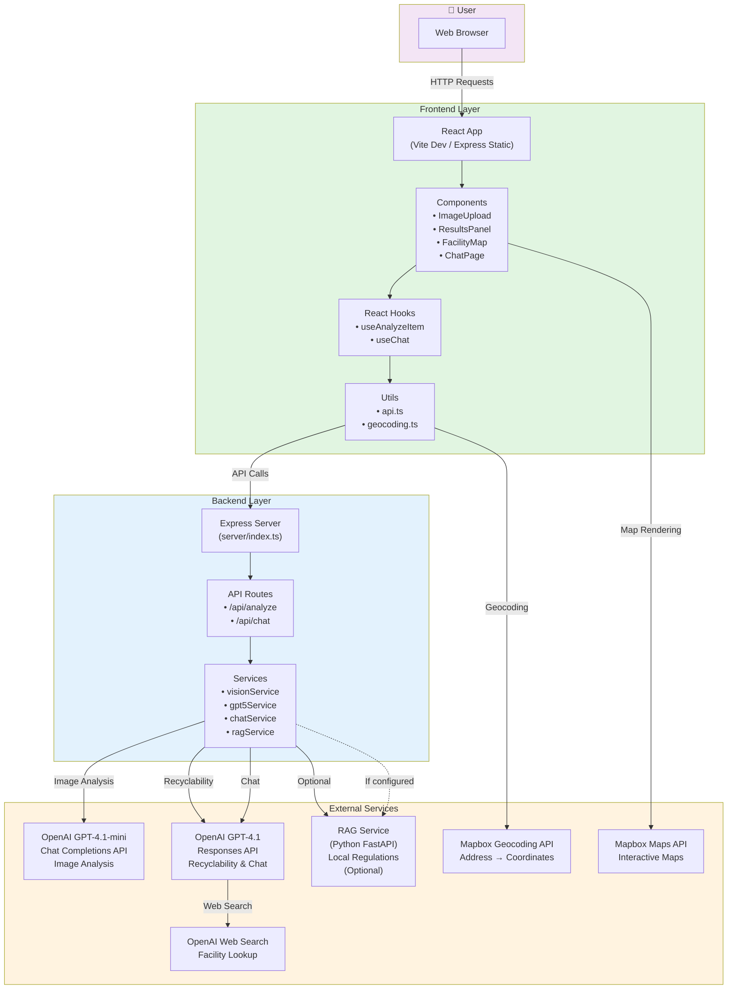
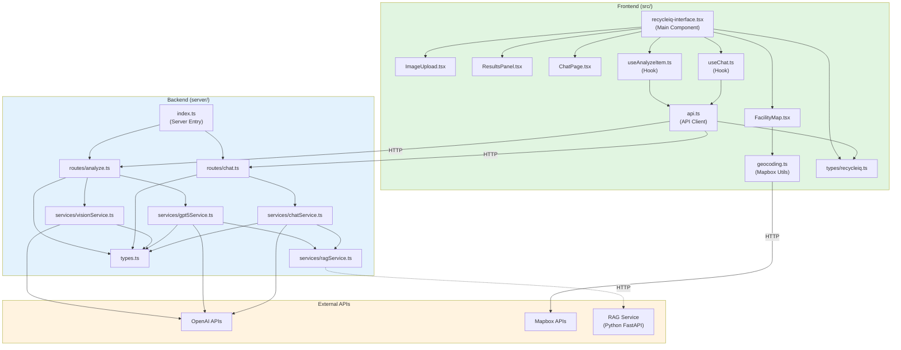
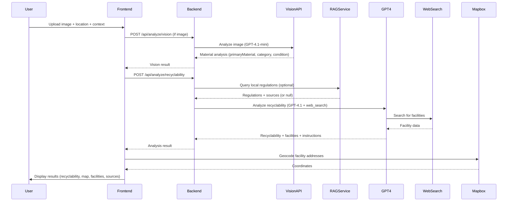
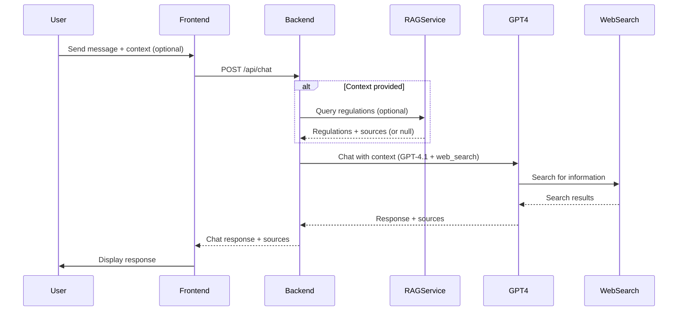

# RecycLens

An AI-powered recycling assistant that helps users identify recyclable items and find nearby recycling facilities.

## Features

- **Image Analysis**: Upload a photo of an item to identify its materials using AI vision
- **Recyclability Assessment**: Get instant feedback on whether an item can be recycled based on local regulations
- **Local Facilities**: Find nearby recycling and disposal facilities using web search
- **Interactive Map**: View facilities on an interactive Mapbox map with markers
- **Chat Assistant**: Ask questions about recycling with context-aware responses
- **Clear Instructions**: Receive step-by-step guidance for proper disposal
- **RAG Integration**: Optional retrieval-augmented generation for location-specific regulations

## Tech Stack

- **Frontend**: React 18 + TypeScript + Vite + Tailwind CSS
- **Backend**: Node.js + Express + TypeScript
- **AI Services**: 
  - OpenAI GPT-4.1-mini (Chat Completions API) for image analysis
  - OpenAI GPT-4.1 (Responses API) for recyclability assessment and chat
  - OpenAI web_search tool for facility lookup and regulations
- **Maps**: Mapbox GL JS + React Map GL + Mapbox Geocoding API
- **RAG Service**: Python FastAPI (optional, for local regulations)

## System Architecture



## File Interactions



## Information Flow

### Analysis Flow



### Chat Flow



## Local Development

### Prerequisites

- **Node.js 18+** and npm
- **Python 3.8+** (optional, for RAG service)
- **OpenAI API key** ([Get one here](https://platform.openai.com/api-keys))
- **Mapbox access token** ([Get one here](https://account.mapbox.com/access-tokens/))

### Step 1: Clone and Install

```bash
# Clone the repository
git clone <repository-url>
cd RecycLens_React

# Install dependencies
npm install
```

### Step 2: Configure Environment Variables

Copy `.env.example` to `.env`:

```bash
cp .env.example .env
```

Edit `.env` and add your API keys:

```env
# Required: OpenAI API key
OPENAI_API_KEY=sk-your-actual-api-key-here

# Required: Mapbox access token (note the VITE_ prefix for frontend)
VITE_MAPBOX_ACCESS_TOKEN=pk.your-mapbox-token-here

# Optional: Server port (defaults to 3001)
PORT=3001

# Optional: Environment mode
NODE_ENV=development

# Optional: RAG service URL (if running locally)
RAG_SERVICE_URL=http://localhost:8001
```

**Important Notes:**
- The Mapbox token uses the `VITE_` prefix because Vite requires this for frontend environment variables
- The Mapbox access token is required for the interactive map feature
- Without the Mapbox token, the map will not display, but other features will still work

### Step 3: Run Backend Server

In **Terminal 1**, start the backend server:

```bash
npm run server
```

The backend will start on `http://localhost:3001`

Verify it's running:
```bash
curl http://localhost:3001/health
```

You should see:
```json
{"status":"ok","timestamp":"2025-01-XX..."}
```

### Step 4: Run Frontend Development Server

In **Terminal 2**, start the frontend development server:

```bash
npm run dev
```

The frontend will start on `http://localhost:5173` (or another port if 5173 is taken)

**Note:** The Vite dev server automatically proxies `/api` requests to the backend at `http://localhost:3001` (configured in `vite.config.ts`)

### Step 5: Open in Browser

Navigate to `http://localhost:5173` to use the application.

### Optional: RAG Service Setup

The RAG service provides location-specific recycling regulations. It's optional - the app will work without it, but with less location-specific accuracy.

#### Prerequisites for RAG Service

- Python 3.8+
- RAG index files in `rag_index_morechunked/` directory

#### Setup RAG Service

1. Navigate to the RAG service directory:
```bash
cd rag_service
```

2. Install Python dependencies:
```bash
pip install -r requirements.txt
```

3. Verify RAG index exists:
```bash
ls ../rag_index_morechunked/
```

You should see files like:
- `default__vector_store.json`
- `docstore.json`
- `index_store.json`

4. Run the RAG service:
```bash
python app.py
```

Or using uvicorn directly:
```bash
uvicorn app:app --port 8001 --reload
```

The RAG service will start on `http://localhost:8001`

5. Verify RAG service is running:
```bash
curl http://localhost:8001/health
```

6. Update backend `.env` to include RAG service URL:
```env
RAG_SERVICE_URL=http://localhost:8001
```

7. Restart the backend server for changes to take effect.

### Development Workflow

**Running All Services:**

1. **Terminal 1**: Backend server (`npm run server`)
2. **Terminal 2**: Frontend dev server (`npm run dev`)
3. **Terminal 3** (optional): RAG service (`cd rag_service && python app.py`)

**Testing:**

- Frontend: `http://localhost:5173`
- Backend health: `http://localhost:3001/health`
- RAG service health: `http://localhost:8001/health` (if running)

**Hot Reload:**

- Frontend: Vite automatically reloads on file changes
- Backend: Restart manually or use a tool like `nodemon`
- RAG service: Use `--reload` flag with uvicorn

## Railway Deployment

### Prerequisites

1. **Railway account** ([Sign up here](https://railway.app))
2. **GitHub account** with your RecycLens repository
3. **API keys ready**:
   - OpenAI API Key
   - Mapbox Access Token
   - RAG Service URL (optional, if deploying RAG service separately)

### Step 1: Connect Repository

1. Go to [Railway Dashboard](https://railway.app/dashboard)
2. Click **"New Project"**
3. Select **"Deploy from GitHub repo"**
4. Choose your `RecycLens_React` repository
5. Railway will automatically detect it's a Node.js project

### Step 2: Configure Environment Variables

In your Railway project dashboard:

1. Go to your project → **Variables** tab
2. Click **"New Variable"** and add each of the following:

**Required Variables:**

```env
OPENAI_API_KEY=sk-your-actual-api-key-here
VITE_MAPBOX_ACCESS_TOKEN=pk.your-mapbox-token-here
NODE_ENV=production
```

**Optional Variables:**

```env
RAG_SERVICE_URL=https://your-rag-service.railway.app
PORT=3001
```

**Important Notes:**
- Railway automatically sets the `PORT` variable - you don't need to set it manually unless you want a specific port
- The `VITE_MAPBOX_ACCESS_TOKEN` must have the `VITE_` prefix for the frontend to access it
- Railway will rebuild when you change environment variables
- If deploying RAG service separately, set `RAG_SERVICE_URL` to that service's URL

### Step 3: Verify Build Settings

Railway should auto-detect the build process from `railway.json`, but you can verify:

1. Go to your service → **Settings** tab
2. Verify:
   - **Build Command**: `npm run build` (from `railway.json`)
   - **Start Command**: `npm start` (from `railway.json`)

The `railway.json` file in the repo handles this automatically:

```json
{
  "build": {
    "builder": "NIXPACKS",
    "buildCommand": "npm run build"
  },
  "deploy": {
    "startCommand": "npm start",
    "restartPolicyType": "ON_FAILURE",
    "restartPolicyMaxRetries": 10
  }
}
```

### Step 4: Deploy

1. Railway will automatically start building and deploying
2. Watch the build logs in the Railway dashboard
3. Once deployed, Railway will provide you with a public URL (e.g., `https://your-app.railway.app`)

### Step 5: Verify Deployment

1. Visit your Railway-provided URL
2. Test the application:
   - Upload an image
   - Enter a location
   - Verify the analysis works
   - Check that the map loads correctly
   - Test the chat functionality

### Step 6: Custom Domain (Optional)

1. Go to your Railway project → **Settings**
2. Click **"Generate Domain"** or add a custom domain
3. Railway will provide SSL certificates automatically

### Environment Variables Reference

| Variable | Required | Description |
|----------|----------|-------------|
| `OPENAI_API_KEY` | Yes | OpenAI API key for vision and responses APIs |
| `VITE_MAPBOX_ACCESS_TOKEN` | Yes | Mapbox access token (must have `VITE_` prefix) |
| `NODE_ENV` | Yes | Set to `production` for deployment |
| `PORT` | No | Server port (Railway sets this automatically) |
| `RAG_SERVICE_URL` | No | URL of RAG service if deployed separately |

### Build Process

Railway follows this build process:

1. **Install dependencies**: `npm install`
2. **Build frontend**: `npm run build` (runs `tsc && vite build`)
3. **Build backend**: `npm run build:server` (runs `tsc --project tsconfig.server.json`)
4. **Start server**: `npm start` (runs `tsx server/index.ts`)

In production, the Express server serves:
- API routes at `/api/*`
- Static frontend files from `dist/` directory
- `index.html` for all non-API routes (client-side routing)

### Troubleshooting Railway Deployment

#### Build Fails

- **Error: Missing dependencies**: Ensure `package.json` has all required dependencies
- **Error: TypeScript errors**: Check that all TypeScript files compile correctly (`npm run build:server`)
- **Error: Build timeout**: Railway has build time limits; ensure your build completes quickly
- **Error: Vite build fails**: Check that `VITE_MAPBOX_ACCESS_TOKEN` is set correctly

#### Runtime Errors

- **Error: OPENAI_API_KEY not set**: Verify environment variables are set correctly in Railway dashboard
- **Error: Mapbox token missing**: Ensure `VITE_MAPBOX_ACCESS_TOKEN` is set with the `VITE_` prefix
- **Error: Port already in use**: Railway sets PORT automatically; don't override it unless necessary
- **Error: RAG service unavailable**: If `RAG_SERVICE_URL` is set but service is down, the app will continue without RAG (graceful degradation)

#### Frontend Not Loading

- **White screen**: Check browser console for errors
- **API calls failing**: Verify the API routes are working (check `/health` endpoint)
- **Map not showing**: Verify `VITE_MAPBOX_ACCESS_TOKEN` is set correctly
- **CORS errors**: Ensure backend CORS is configured (should be enabled by default)

#### Check Logs

1. Go to your Railway project
2. Click on your service
3. Go to **Deployments** tab
4. Click on the latest deployment
5. View **Logs** to see runtime errors

### Monitoring

- Railway provides basic metrics in the dashboard
- Check the **Metrics** tab for CPU, memory, and network usage
- Set up alerts if needed

### Updating Your Deployment

Railway automatically deploys when you push to your connected GitHub branch:

1. Make changes locally
2. Commit and push to GitHub:
   ```bash
   git add .
   git commit -m "Your changes"
   git push origin main
   ```
3. Railway will automatically detect and deploy the changes

You can also trigger manual deployments from the Railway dashboard.

### Cost Considerations

- Railway offers a free tier with usage limits
- Monitor your usage in the dashboard
- Consider upgrading if you exceed free tier limits
- OpenAI API usage is billed separately based on your usage

## How It Works

### Analysis Process

1. **User Input**: User uploads an image (optional), enters location, and optionally adds context
2. **Vision Analysis** (if image provided):
   - Image is sent to OpenAI GPT-4.1-mini (Chat Completions API)
   - AI identifies:
     - Primary and secondary materials
     - Item condition (clean, soiled, damaged, etc.)
     - Contaminants (food residue, grease, etc.)
     - Material category
     - Confidence score
3. **RAG Query** (optional, if RAG service configured):
   - System queries RAG service for location-specific regulations
   - RAG service searches local recycling documentation
   - Returns relevant regulations and source documents
4. **Recyclability Assessment**:
   - Vision results (if available) and context are sent to OpenAI GPT-4.1 (Responses API)
   - AI uses web_search tool to:
     - Determine recyclability based on local regulations
     - Find nearby recycling/disposal facilities
     - Generate step-by-step disposal instructions
   - Returns recyclability decision, instructions, and facility list
5. **Geocoding**: Mapbox Geocoding API converts facility addresses to coordinates
6. **Results Display**: Frontend displays:
   - Recyclability decision with confidence score
   - Disposal instructions
   - Interactive map with facility markers
   - Facility cards with details and links
   - Source citations (RAG sources and web search sources)

### Chat Process

1. **User Message**: User sends a message, optionally with context from a previous analysis
2. **RAG Query** (if context provided):
   - System queries RAG service for location-specific regulations related to the item
3. **AI Response**:
   - Message and context are sent to OpenAI GPT-4.1 (Responses API)
   - AI uses web_search tool for additional information
   - Returns helpful response with source citations
4. **Display**: Response and sources are displayed to the user

### Graceful Degradation

- **RAG Service Unavailable**: If RAG service is not configured or unavailable, the app continues without location-specific regulations. Web search still provides general recycling information.
- **Mapbox Token Missing**: Map functionality is disabled, but other features work normally.
- **Image Not Provided**: User can provide context description instead, and the system will analyze based on text description.

## API Endpoints

### POST /api/analyze

Analyzes an item for recyclability (combines vision and recyclability analysis).

**Request Body:**
```json
{
  "image": "data:image/jpeg;base64,...",
  "location": "Ithaca, NY 14850",
  "context": "Plastic container with food residue"
}
```

**Note:** Either `image` or `context` is required.

**Response:**
```json
{
  "isRecyclable": true,
  "category": "plastic-container",
  "bin": "recycling",
  "confidence": 0.87,
  "materialDescription": "Plastic bottle",
  "instructions": [
    "Rinse the container thoroughly",
    "Remove any labels if possible",
    "Place in recycling bin"
  ],
  "reasoning": "This is a clean plastic container that can be recycled.",
  "locationUsed": "Ithaca, NY 14850",
  "facilities": [
    {
      "name": "Green Valley Recycling",
      "type": "Recycling Center",
      "address": "123 Main St, Ithaca, NY",
      "url": "https://example.com",
      "notes": "Accepts plastic containers"
    }
  ],
  "ragSources": ["https://example.com/regulations"],
  "ragQueried": true,
  "webSearchSources": ["https://example.com/recycling-guide"]
}
```

### POST /api/analyze/vision

Analyzes an image to identify materials (vision analysis only).

**Request Body:**
```json
{
  "image": "data:image/jpeg;base64,..."
}
```

**Response:**
```json
{
  "stage": "vision",
  "result": {
    "primaryMaterial": "clear plastic",
    "secondaryMaterials": ["paper label", "plastic cap"],
    "category": "plastic-container",
    "condition": "clean and empty",
    "contaminants": [],
    "confidence": 0.92,
    "shortDescription": "A clear plastic water bottle with a blue cap, mostly empty"
  }
}
```

### POST /api/analyze/recyclability

Analyzes recyclability based on vision results and/or context (recyclability analysis only).

**Request Body:**
```json
{
  "visionResult": {
    "primaryMaterial": "clear plastic",
    "category": "plastic-container",
    "condition": "clean and empty",
    "contaminants": [],
    "confidence": 0.92,
    "shortDescription": "A clear plastic water bottle"
  },
  "location": "Ithaca, NY 14850",
  "context": "Plastic container with food residue"
}
```

**Note:** Either `visionResult` or `context` is required.

**Response:**
```json
{
  "stage": "recyclability",
  "result": {
    "isRecyclable": true,
    "category": "plastic-container",
    "bin": "recycling",
    "confidence": 0.87,
    "materialDescription": "Plastic bottle",
    "instructions": [
      "Rinse the container thoroughly",
      "Place in recycling bin"
    ],
    "reasoning": "This is a clean plastic container that can be recycled.",
    "locationUsed": "Ithaca, NY 14850",
    "facilities": [...],
    "ragSources": [...],
    "webSearchSources": [...]
  }
}
```

### POST /api/chat

Sends a chat message with optional context.

**Request Body:**
```json
{
  "message": "Can I recycle this item?",
  "conversationHistory": [
    {
      "role": "user",
      "content": "What is this?"
    },
    {
      "role": "assistant",
      "content": "This is a plastic bottle."
    }
  ],
  "context": {
    "analysisData": {
      "isRecyclable": true,
      "category": "plastic-container",
      "locationUsed": "Ithaca, NY 14850"
    },
    "location": "Ithaca, NY 14850",
    "material": "Plastic bottle",
    "visionData": {
      "primaryMaterial": "clear plastic",
      "category": "plastic-container"
    }
  }
}
```

**Response:**
```json
{
  "response": "Yes, you can recycle this plastic bottle in Ithaca, NY. Make sure to rinse it first...",
  "sources": {
    "rag": ["https://example.com/regulations"],
    "web": ["https://example.com/recycling-guide"]
  }
}
```

### GET /health

Health check endpoint.

**Response:**
```json
{
  "status": "ok",
  "timestamp": "2025-01-XXTXX:XX:XX.XXXZ"
}
```

## Example cURL Requests

### Full Analysis

```bash
curl -X POST http://localhost:3001/api/analyze \
  -H "Content-Type: application/json" \
  -d '{
    "image": "data:image/jpeg;base64,/9j/4AAQSkZJRg...",
    "location": "Ithaca, NY 14850",
    "context": "Plastic bottle"
  }'
```

### Vision Analysis Only

```bash
curl -X POST http://localhost:3001/api/analyze/vision \
  -H "Content-Type: application/json" \
  -d '{
    "image": "data:image/jpeg;base64,/9j/4AAQSkZJRg..."
  }'
```

### Recyclability Analysis Only

```bash
curl -X POST http://localhost:3001/api/analyze/recyclability \
  -H "Content-Type: application/json" \
  -d '{
    "visionResult": {
      "primaryMaterial": "clear plastic",
      "category": "plastic-container",
      "condition": "clean and empty",
      "contaminants": [],
      "confidence": 0.92,
      "shortDescription": "A clear plastic water bottle"
    },
    "location": "Ithaca, NY 14850",
    "context": ""
  }'
```

### Chat

```bash
curl -X POST http://localhost:3001/api/chat \
  -H "Content-Type: application/json" \
  -d '{
    "message": "Can I recycle this item?",
    "context": {
      "location": "Ithaca, NY 14850",
      "material": "Plastic bottle"
    }
  }'
```

## Project Structure

```
RecycLens_React/
├── server/                      # Backend Express server
│   ├── index.ts                 # Server entry point
│   ├── routes/                  # API routes
│   │   ├── analyze.ts          # Analysis endpoints
│   │   └── chat.ts             # Chat endpoint
│   ├── services/                # Business logic
│   │   ├── visionService.ts    # Vision API integration (GPT-4.1-mini)
│   │   ├── gpt5Service.ts      # Recyclability analysis (GPT-4.1)
│   │   ├── chatService.ts      # Chat service (GPT-4.1)
│   │   └── ragService.ts        # RAG service client
│   └── types.ts                 # Backend TypeScript types
├── src/                         # Frontend React app
│   ├── components/              # React components
│   │   ├── ImageUpload.tsx     # Image upload component
│   │   ├── ResultsPanel.tsx    # Results display
│   │   ├── FacilityCard.tsx    # Facility card component
│   │   ├── FacilityMap.tsx     # Mapbox map component
│   │   ├── ChatPage.tsx         # Chat interface
│   │   ├── ChatCard.tsx         # Chat card component
│   │   ├── SourcesPanel.tsx    # Sources display
│   │   ├── HowItWorks.tsx       # How it works page
│   │   └── GlassSurface.tsx    # Glass morphism UI component
│   ├── hooks/                   # Custom React hooks
│   │   ├── useAnalyzeItem.ts   # Analysis hook
│   │   └── useChat.ts           # Chat hook
│   ├── utils/                   # Utility functions
│   │   ├── api.ts               # API client functions
│   │   └── geocoding.ts         # Mapbox geocoding utility
│   ├── types/                   # TypeScript types
│   │   └── recycleiq.ts         # Frontend types
│   ├── App.tsx                  # Root component
│   ├── main.tsx                 # React entry point
│   └── index.css                # Global styles
├── rag_service/                  # RAG service (Python FastAPI)
│   ├── app.py                   # FastAPI application
│   ├── rag_query.py             # RAG query logic
│   ├── requirements.txt         # Python dependencies
│   └── README.md                # RAG service documentation
├── rag_index_morechunked/       # RAG index files
│   ├── default__vector_store.json
│   ├── docstore.json
│   ├── graph_store.json
│   ├── image__vector_store.json
│   └── index_store.json
├── rag_docs/                     # Source documents for RAG
├── recycleiq-interface.tsx       # Main UI component
├── vite.config.ts                # Vite configuration
├── railway.json                  # Railway deployment config
├── package.json                  # Node.js dependencies
├── tsconfig.json                 # TypeScript config (frontend)
├── tsconfig.server.json          # TypeScript config (backend)
├── tailwind.config.js            # Tailwind CSS config
├── postcss.config.js             # PostCSS config
├── env.example                   # Environment variables template
└── README.md                     # This file
```

## Troubleshooting

### Backend won't start

- Check that `OPENAI_API_KEY` is set in `.env`
- Ensure port 3001 (or your configured port) is not in use
- Check console for error messages
- Verify Node.js version is 18+

### Frontend can't connect to backend

- Ensure backend server is running on port 3001
- Check Vite proxy configuration in `vite.config.ts` (should proxy `/api` to `http://localhost:3001`)
- Verify CORS is enabled in backend (should be enabled by default)
- Check browser console for network errors

### API errors

- Verify your OpenAI API key is valid and has credits
- Check that you have access to:
  - GPT-4.1-mini (Chat Completions API) for vision
  - GPT-4.1 (Responses API) for recyclability and chat
  - Web search tool access
- Review server logs for detailed error messages
- Ensure your OpenAI account has access to the web search tool

### Image upload issues

- Ensure image is less than 10MB
- Supported formats: JPEG, PNG, GIF, WebP
- Check browser console for errors
- Verify base64 encoding is working correctly

### Map not displaying

- Verify `VITE_MAPBOX_ACCESS_TOKEN` is set in `.env` (note the `VITE_` prefix)
- Check browser console for Mapbox-related errors
- Ensure the token has the correct scopes (Geocoding API and Maps API)
- Map will only display when facilities are available
- Restart the dev server after adding the environment variable

### RAG service issues

- Verify RAG service is running: `curl http://localhost:8001/health`
- Check that `RAG_SERVICE_URL` is set correctly in backend `.env`
- Verify RAG index files exist in `rag_index_morechunked/`
- Check RAG service logs for errors
- **Note**: RAG service is optional - the app will work without it (graceful degradation)

### TypeScript compilation errors

- Run `npm run build:server` to check backend TypeScript errors
- Run `npm run build` to check frontend TypeScript errors
- Ensure all dependencies are installed: `npm install`

## Development Notes

### Backend Architecture

- Express server serves both API routes and static frontend files in production
- In development, Vite dev server handles frontend, Express handles API
- In production, Express serves built static files from `dist/` directory
- Client-side routing: Express returns `index.html` for all non-API routes

### AI Integration

- **Vision Analysis**: GPT-4.1-mini (Chat Completions API) handles image analysis for material identification
- **Recyclability & Chat**: GPT-4.1 (Responses API) with `web_search` tool handles recyclability decisions, facility lookup, and chat responses
- **Web Search**: OpenAI's web_search tool provides real-time information about facilities and regulations

### Frontend

- **Development**: Vite dev server with proxy to backend (`/api` → `http://localhost:3001`)
- **Production**: Built static files served by Express from `dist/` directory
- **State Management**: React hooks (`useAnalyzeItem`, `useChat`) manage API calls and state

### Maps

- **Mapbox GL JS**: Interactive map rendering
- **React Map GL**: React wrapper for Mapbox GL JS
- **Mapbox Geocoding API**: Converts facility addresses to coordinates for map markers

### RAG Service

- **Optional**: RAG service provides location-specific regulations
- **Graceful Degradation**: App continues without RAG if service is unavailable
- **Python FastAPI**: Separate service that can be deployed independently
- **Query Flow**: Backend queries RAG service with material and location, receives regulations and sources

### Environment Variables

- `OPENAI_API_KEY`: Required for both Vision and Responses API
- `VITE_MAPBOX_ACCESS_TOKEN`: Required for map display (note the `VITE_` prefix for frontend access)
- `PORT`: Server port (defaults to 3001, automatically set by Railway in production)
- `NODE_ENV`: Environment mode (`development` or `production`)
- `RAG_SERVICE_URL`: Optional URL of RAG service (e.g., `http://localhost:8001` or production URL)

### Build Process

**Development:**
- Frontend: `npm run dev` (Vite dev server)
- Backend: `npm run server` (tsx runs TypeScript directly)

**Production:**
- Frontend: `npm run build` (TypeScript compilation + Vite build)
- Backend: `npm run build:server` (TypeScript compilation)
- Start: `npm start` (runs compiled backend with tsx)

## License

© 2025 RecycLens. Making recycling simple.
